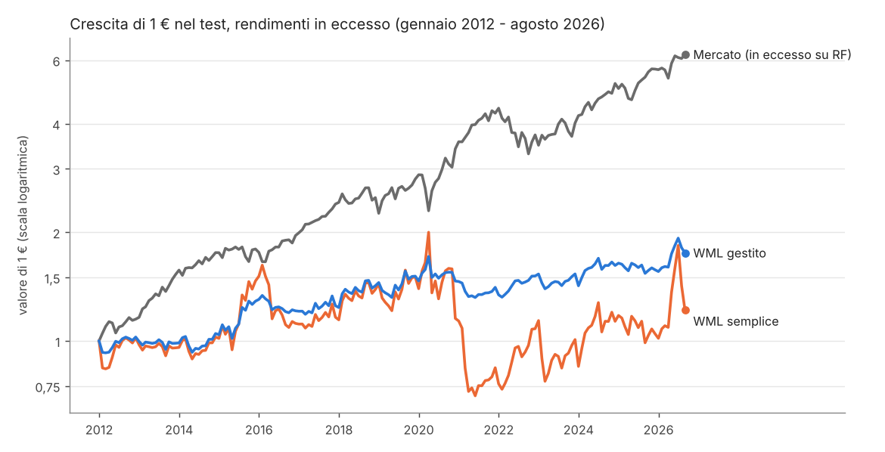
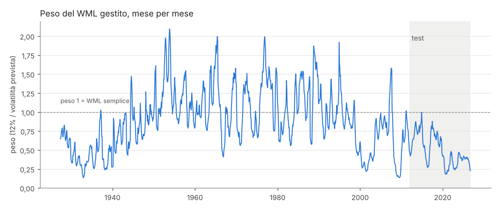
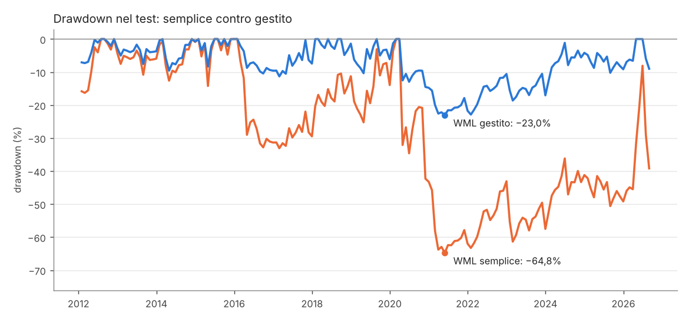
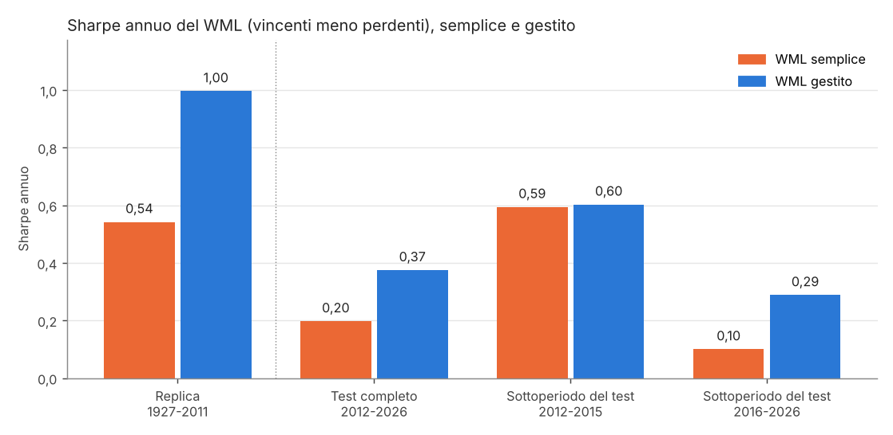

# Momentum gestito per il rischio: replica e test dopo il 2011

In questo progetto replico la strategia di Barroso e Santa-Clara (2015), "Momentum has its moments". La base è il momentum lungo-corto di Jegadeesh e Titman (1993): comprare i titoli che sono saliti di più nell'ultimo anno e vendere allo scoperto quelli scesi di più. Questa strategia si chiama WML, *winners minus losers* (vincenti meno perdenti). Nella versione del paper l'esposizione è scalata in base alla volatilità prevista. Poi provo la strategia sul periodo successivo ai dati del paper, gennaio 2012 - agosto 2026, con le stesse regole e senza scegliere io i parametri della strategia.

Le domande sono due: **la gestione del rischio riduce i crolli del momentum anche dopo il 2011?** E **migliora il rendimento per unità di rischio (indice di Sharpe)?**

## Indice

1. [Risultato in breve](#1-risultato-in-breve)
2. [Termini essenziali](#2-termini-essenziali)
3. [Come ho lavorato](#3-come-ho-lavorato)
4. [Dati](#4-dati)
5. [Il metodo in quattro passi](#5-il-metodo-in-quattro-passi)
6. [Cosa confronto](#6-cosa-confronto)
7. [Risultati](#7-risultati)
8. [Limiti](#8-limiti)
9. [Come riprodurre i numeri](#9-come-riprodurre-i-numeri)
10. [Struttura del repository](#10-struttura-del-repository)
11. [Glossario](#11-glossario)
12. [Riferimenti](#12-riferimenti)

I dettagli tecnici (formule, convenzioni, bootstrap, costi, controlli sui dati) sono in [docs/metodo.md](docs/metodo.md). In [docs/domande_e_risposte.md](docs/domande_e_risposte.md) ci sono le risposte brevi alle domande più probabili.

---

## 1. Risultato in breve

Sul periodo di test (gennaio 2012 - agosto 2026, 176 mesi), rendimenti lordi:

- **Il rischio scende molto.** Il drawdown massimo passa da −64,8% a −23,0%, il mese peggiore da −32,1% a −12,5%, la curtosi in eccesso da 2,10 a 1,05. L'ipotesi sul rischio, fissata prima del test, è confermata. Una parte del calo viene però dalla sola esposizione più bassa (sezione 7.2).
- **Lo Sharpe sale da 0,197 a 0,375.** La differenza, calcolata sui valori non arrotondati, è +0,177, con intervallo al 95% [+0,003; +0,333]. Per la regola fissata prima è "evidenza di miglioramento", ma il limite inferiore è appena sopra lo zero: è un'evidenza al limite.
- **Il momentum in sé ha reso poco dopo il 2011.** Né il semplice né il gestito hanno uno Sharpe distinguibile da zero, mentre il mercato azionario nello stesso periodo ha Sharpe 0,94.
- **Con i costi ipotizzati il vantaggio non è più distinguibile da zero.** Nello scenario medio (prestito titoli 0,5% e negoziazione 2% annui, 10 punti base sulla variazione del peso) il gestito scende a Sharpe 0,19; nello scenario alto la strategia lungo-corta non rende.

In sintesi: la gestione della volatilità riduce i crolli anche fuori campione. Il vantaggio sullo Sharpe c'è, ma è piccolo, si concentra nel 2016-2026 e con i costi resta positivo senza essere distinguibile da zero.



## 2. Termini essenziali

**WML** è il rendimento del decile dei titoli vincenti (quelli con il rendimento passato più alto) meno quello del decile dei perdenti (il rendimento passato più basso). **WML semplice** è questa strategia con esposizione sempre pari a 1; **WML gestito** è la stessa strategia moltiplicata ogni mese per un **peso** che si abbassa quando la volatilità prevista sale. L'**indice di Sharpe** è il rendimento medio in eccesso diviso per la volatilità; il **drawdown massimo** è la perdita più grande dal punto più alto precedente del capitale; l'**intervallo al 95%** dice quanto è incerta una stima: se è tutto sopra lo zero, la differenza è distinguibile da zero. Tutti gli altri termini sono spiegati nel [glossario](#11-glossario).

## 3. Come ho lavorato

Per non scegliere le regole guardando i risultati, ho fissato tutto prima di guardare il periodo di test.

- **Regole dal paper.** Volatilità obiettivo 12%, 126 giorni per la stima, ribilanciamento mensile, nessun tetto alla leva: sono le scelte di Barroso e Santa-Clara. Le mie scelte riguardano solo la valutazione (bootstrap, sottoperiodi, scenari di costo) e le ho fissate prima del test.
- **Replica come verifica del codice.** Prima ho rifatto i conti sul periodo del paper (1927-2011). La condizione per proseguire era ritrovare gli Sharpe del paper entro ±0,10.
- **Criteri scritti prima del test.** In [docs/criteri_del_verdetto.md](docs/criteri_del_verdetto.md) ci sono le due ipotesi e la regola di decisione. Il repository non può provare quando li ho scritti, quindi è una mia dichiarazione. La configurazione è congelata in `config_congelata.json` insieme all'impronta SHA-256 dei criteri.
- **Test eseguito una volta.** `scripts/04_test_fuori_campione.py` si rifiuta di partire se i criteri sono cambiati, se la configurazione non coincide con i valori del codice o se nella copia di lavoro l'esito esiste già. È una protezione contro i rilanci per errore, non una garanzia. L'esito originale è in [docs/esito_test.txt](docs/esito_test.txt).
- **Analisi dopo il test, dichiarate come tali.** La sensibilità del bootstrap, il confronto a pari volatilità, il meccanismo e i mesi di crollo li ho calcolati dopo ([docs/analisi_dopo_il_test.txt](docs/analisi_dopo_il_test.txt)). Aiutano a leggere il risultato, ma non cambiano il verdetto.

Le due ipotesi:

1. **Rischio:** il WML gestito ha drawdown massimo, mese peggiore e curtosi in eccesso più bassi del WML semplice. È confermata solo se migliorano tutte e tre.
2. **Sharpe (misura primaria):** differenza di Sharpe gestito meno semplice, con intervallo al 95% da bootstrap stazionario. Evidenza se l'intervallo è tutto sopra lo zero; indicazione debole se la stima è positiva ma l'intervallo include lo zero; altrimenti nessun miglioramento.

## 4. Dati

Tutti i dati vengono dalla [Kenneth R. French Data Library](https://mba.tuck.dartmouth.edu/pages/faculty/ken.french/data_library.html), versione costruita sul database CRSP 202608. Sono gratuiti e non soffrono di distorsione da sopravvivenza, perché i portafogli includono anche i titoli poi usciti dal listino.

| File | Uso |
|---|---|
| 10 portafogli sul momentum, mensili | WML = decile vincente meno decile perdente; vincenti solo lunghi |
| 10 portafogli sul momentum, giornalieri | WML giornaliero, solo per stimare la volatilità |
| Fattore Mom, mensile e giornaliero | robustezza: la versione di French del momentum (6 portafogli taglia × momentum) |
| 6 portafogli taglia × momentum | controllo: il fattore Mom si ricostruisce da questi |
| 3 fattori, mensili e giornalieri | mercato (Mkt-RF) e tasso privo di rischio (RF) |

Periodi dei portafogli sul momentum: mensili da gennaio 1927 ad agosto 2026 (1.196 mesi), giornalieri dal 3 novembre 1926 al 31 agosto 2026 (26.216 giorni); i file dei fattori partono da luglio 1926. `scripts/01_controlla_dati.py` verifica che non ci siano valori mancanti né mesi saltati, che i giorni dei decili siano presenti in tutti i file giornalieri, che il fattore Mom si ricostruisca dai 6 portafogli (differenza massima 0,01 punti, cioè l'arrotondamento) e che il mercato mensile coincida con il composto dei giornalieri. Controlla anche che gli zip siano quelli usati qui (impronte SHA-256 in `src/risk_managed_momentum/dati.py`).

I portafogli mensili sono ricostituiti ogni mese (rendimento passato da t−12 a t−2), quelli giornalieri ogni giorno. I rendimenti della strategia vengono sempre dai file mensili; i giornalieri servono solo a stimare la volatilità.

I dati non sono nel repository: `scripts/00_scarica_dati.py` li scarica (controllando prima il robots.txt), oppure si scaricano a mano (istruzioni nello script).

## 5. Il metodo in quattro passi

1. **Momentum (WML).** Ogni mese il rendimento di WML è il decile dei vincenti meno quello dei perdenti, pesati per capitalizzazione. La strategia è autofinanziata (lo scoperto finanzia l'acquisto), quindi il suo rendimento è già un rendimento in eccesso.
2. **Volatilità prevista.** Alla fine del mese t−1 prendo gli ultimi 126 rendimenti giornalieri di WML (circa sei mesi; prima del 1952 si contrattava anche il sabato, quindi circa cinque) e calcolo la varianza mensile come 21 × media dei quadrati. La volatilità annua è la radice di 12 volte la varianza mensile.
3. **Peso.** Peso del mese t = 12% / volatilità prevista. Se il momentum è agitato il peso scende sotto 1, se è calmo sale sopra 1. Non c'è un tetto.
4. **Rendimento gestito.** Rendimento del mese t = peso × WML del mese t. Il peso usa solo dati fino al mese prima. Lo controllano tre test automatici in `tests/`: alterare i giorni del mese t non cambia il peso del mese t; troncare i dati non cambia i pesi passati; sui dati reali il peso di gennaio 2012 si ottiene con i dati fino a dicembre 2011.

L'idea economica: la volatilità del momentum è molto persistente e si prevede bene, mentre il suo rendimento medio non è più alto quando la volatilità è alta. Scalando per la volatilità si toglie soprattutto rischio, non rendimento atteso. Secondo Daniel e Moskowitz (2016) i crolli del momentum arrivano soprattutto quando, dopo un ribasso del mercato e in fasi di alta volatilità, il mercato rimbalza e i titoli perdenti (la gamba corta) salgono di colpo: sono periodi in cui la volatilità prevista è già alta.

Moreira e Muir (2017) hanno esteso l'idea ad altri fattori, ma Cederburg e coautori (2020) mostrano che, applicate in tempo reale, le versioni gestite per la volatilità non battono in modo sistematico gli originali. Per questo serve un test fuori campione su una strategia precisa, invece di dare il risultato per scontato.



## 6. Cosa confronto

| Serie | Perché |
|---|---|
| WML semplice | il riferimento principale: stessa strategia senza gestione del rischio |
| Mom di French, semplice e gestito | robustezza: un'altra costruzione del momentum (sei portafogli, 30% estremi) |
| Vincenti solo lunghi, semplici e gestiti | il solo decile vincente, senza scoperto: quanto conta la gamba corta |
| Mercato (Mkt-RF) | il confronto naturale per chi investe |
| Mercato + WML gestito | il momentum gestito aggiunto a un portafoglio di mercato |

Tutte le serie sono rendimenti mensili in eccesso sul tasso privo di rischio. Sharpe annuo = media / deviazione standard × √12.

## 7. Risultati

### 7.1 Replica del paper (maggio 1927 - dicembre 2011, 1.016 mesi)

| | Sharpe | paper | Curtosi in eccesso | paper | Mese peggiore | paper |
|---|---|---|---|---|---|---|
| WML semplice | 0,54 | 0,53 | 17,95 | 18,24 | −77,66% | −78,96% |
| WML gestito | 1,00 | 0,97 | 2,00 | 2,68 | −24,16% | −28,40% |

I pesi vanno da 0,14 a 2,09 (nel paper 0,13-2,00). La replica è superata ([docs/esito_replica.txt](docs/esito_replica.txt)). Sugli Sharpe la distanza è piccola; sulle code del gestito è più ampia (curtosi 2,00 contro 2,68, mese peggiore −24,2% contro −28,4%). Le cause probabili, che non ho verificato una per una, sono la versione più recente del database CRSP, il WML giornaliero ricostituito ogni giorno che uso per la volatilità e un mese iniziale forse diverso da quello del paper.

### 7.2 Test fuori campione (gennaio 2012 - agosto 2026, 176 mesi)

| | Media annua | Volatilità | Sharpe | Curtosi in eccesso | Mese peggiore | Drawdown massimo |
|---|---|---|---|---|---|---|
| WML semplice | 5,70% | 28,89% | 0,20 | 2,10 | −32,08% | −64,77% |
| **WML gestito** | 4,58% | 12,22% | 0,37 | 1,05 | −12,52% | −23,03% |
| Mom di French | 2,40% | 13,28% | 0,18 | 2,26 | −16,21% | −25,38% |
| Mom gestito | 4,36% | 11,35% | 0,38 | 0,77 | −9,71% | −18,56% |
| Vincenti solo lunghi | 17,81% | 21,48% | 0,83 | 2,91 | −15,81% | −31,28% |
| Vincenti gestiti | 9,31% | 11,07% | 0,84 | 1,78 | −10,82% | −14,04% |
| Mercato | 13,57% | 14,48% | 0,94 | 0,97 | −13,37% | −25,28% |
| Mercato + WML gestito | 18,15% | 16,39% | 1,11 | 0,80 | −12,49% | −18,80% |

**Verdetto.** Ipotesi 1 (rischio): confermata. Ipotesi 2 (Sharpe): 0,197 contro 0,375, differenza +0,177, intervallo al 95% [+0,003; +0,333], quindi "evidenza di miglioramento" per la regola fissata prima, al limite. Con blocchi del bootstrap più corti (1 o 3 mesi) l'intervallo include lo zero, e il test di Jobson e Korkie con la correzione di Memmel dà p = 0,069.

Altre letture, tutte descrittive:

- Con il fattore Mom di French il risultato va nella stessa direzione: differenza di Sharpe +0,203 [+0,023; +0,361].
- Regredendo il gestito sul semplice, l'alfa è del 2,33% annuo (t = 2,31, errori di Newey e West) con beta 0,39: il gestito non è solo una versione ridotta del semplice.
- Nel test il peso va da 0,18 a 0,99, con media 0,50. La volatilità prevista del momentum è stata sempre sopra il 12%, quindi la strategia non ha mai usato leva.
- A pari volatilità (confronto fatto dopo il test) il guadagno sul rischio si riduce. Il WML semplice moltiplicato per 0,423 ha la stessa volatilità del gestito (12,22%); rispetto a questa versione il gestito ha drawdown −23,0% contro −32,7%, curtosi 1,05 contro 2,10 e mese peggiore −12,5% contro −13,6%. Il "quando" ridurre l'esposizione conta, ma meno di quanto dica il confronto diretto, e sul mese peggiore quasi per niente.
- Sui vincenti solo lunghi la gestione dimezza volatilità e drawdown ma non cambia lo Sharpe (0,83 contro 0,84; differenza +0,012 [−0,172; +0,176]): qui agisce solo come riduzione dell'esposizione. È coerente con l'idea che il guadagno sullo Sharpe passi dalla gamba corta.
- Mercato + WML gestito ha Sharpe 1,11 contro 0,94 del mercato e drawdown −18,8% contro −25,3%, ma la differenza di Sharpe (+0,170 [−0,173; +0,468]) non è distinguibile da zero.



### 7.3 Dove nasce il miglioramento

| Mese | WML semplice | Peso | WML gestito | Mercato | Vincenti | Perdenti |
|---|---|---|---|---|---|---|
| aprile 2020 | −32,08% | 0,39 | −12,52% | +13,60% | +14,67% | +46,75% |
| novembre 2020 | −27,10% | 0,20 | −5,44% | +12,45% | +10,38% | +37,48% |
| luglio 2026 | −22,71% | 0,26 | −5,93% | −0,61% | −15,41% | +7,30% |
| febbraio 2021 | −22,57% | 0,23 | −5,16% | +2,81% | −2,78% | +19,79% |
| gennaio 2023 | −21,58% | 0,26 | −5,59% | +6,61% | +0,52% | +22,10% |

Mercato: rendimento in eccesso su RF. Vincenti e perdenti: rendimenti dei due decili, non in eccesso.

I cinque mesi peggiori del semplice arrivano tutti con un peso tra 0,20 e 0,39, fissato con i dati del mese prima e sotto la media del test (0,50). In quattro casi su cinque il crollo viene dal rimbalzo dei perdenti, con il mercato in rialzo. È simile al meccanismo di Daniel e Moskowitz, anche se solo aprile 2020 e gennaio 2023 arrivano dopo due anni di mercato in calo, e di poco (−0,7% e −0,8%). Luglio 2026 è diverso: lì sono crollati i vincenti.

La volatilità prevista ha una correlazione di +0,65 con quella realizzata nel mese dopo: il rischio si prevede bene. Con il rendimento del WML la correlazione è −0,14 (t ≈ −1,9): nel test il rendimento non sale quando la volatilità prevista è alta, ma questo da solo non è statisticamente distinguibile da zero.

Per sottoperiodi il quadro è meno uniforme. Nel 2012-2015 le due versioni hanno lo stesso Sharpe (0,59 contro 0,60). Nel 2016-2026 il semplice scende a 0,10 e il gestito tiene 0,29.



### 7.4 Costi

I file di French non dicono quanto si scambia, quindi i costi sono ipotesi esplicite (dettagli in [docs/metodo.md](docs/metodo.md)):

| Scenario | Prestito titoli | Negoziazione | Variazione del peso | Sharpe semplice | Sharpe gestito | Differenza [IC 95%] |
|---|---|---|---|---|---|---|
| lordo | 0% | 0% | 0 pb | 0,20 | 0,37 | +0,177 [+0,003; +0,333] |
| medio | 0,5% | 2% | 10 pb | 0,04 | 0,19 | +0,144 [−0,029; +0,298] |
| alto | 1% | 4% | 20 pb | −0,11 | 0,00 | +0,110 [−0,062; +0,263] |

Il gestito resta davanti al semplice in tutti gli scenari perché parte da uno Sharpe lordo più alto. Paga circa metà dei costi in punti di rendimento, ma ha meno della metà della volatilità, quindi in termini di Sharpe i costi lo penalizzano un po' di più: la differenza scende a +0,144 e +0,110 e non è più distinguibile da zero. Negli scenari medio e alto nessuna delle due versioni lungo-corte ha un rendimento interessante nel periodo di test.

## 8. Limiti

- Portafogli teorici: i decili di French non hanno costi, vincoli allo scoperto né impatto di mercato. I costi sono solo scenari.
- Volatilità dal file giornaliero: uso il WML giornaliero ricostituito ogni giorno, non i rendimenti giornalieri dei decili mensili come il paper. La replica degli Sharpe resta comunque vicina al paper.
- Sabati prima del 1952: fino a maggio 1952 la borsa era aperta anche il sabato (24,5 giorni al mese in media), quindi 126 giorni sono circa cinque mesi e il fattore 21 sottostima la varianza mensile; i pesi storici sono un po' più alti. Seguo la stessa convenzione del paper; nel test non conta.
- Un solo periodo di test, con potenza limitata: 176 mesi sono pochi per distinguere differenze di Sharpe dell'ordine di 0,1-0,2. Il limite inferiore a +0,003 va letto come un risultato al confine, non come una prova solida.
- Leva senza tetto: nel campione storico il peso arriva a 2,09. Nel test non supera 1, ma in un periodo calmo la strategia userebbe leva.
- Il momentum è stato più debole nel test: il WML semplice ha Sharpe 0,20 contro 0,54 del 1927-2011, ma con un errore standard della differenza di circa 0,28 (formula di Lo 2002) la differenza non è significativa. È coerente con il calo delle anomalie dopo la pubblicazione (McLean e Pontiff 2016), ma questo progetto non lo dimostra.

## 9. Come riprodurre i numeri

Con Python 3.10 o successivo:

```
pip install -e ".[dev,dati,notebook]"         # oppure: pip install -r requirements.txt
python scripts/00_scarica_dati.py             # oppure gli zip a mano in data/raw
python scripts/01_controlla_dati.py           # controlli sui dati e sulla versione degli zip
python scripts/02_replica_paper.py            # replica 1927-2011 -> docs/esito_replica.txt
python scripts/04_test_fuori_campione.py      # test 2012-2026 -> output/esito_test.txt
python scripts/05_analisi_dopo_il_test.py     # letture dopo il test -> docs/analisi_dopo_il_test.txt
python scripts/06_grafici.py                  # grafici in img/
python -m pytest -q                           # test automatici
```

`scripts/03_congela_configurazione.py` manca dall'elenco perché è già stato eseguito una volta: `config_congelata.json` esiste e lo script si rifiuta di sovrascriverlo.

I numeri esatti si ottengono solo con gli stessi zip (versione CRSP 202608, impronte in `dati.py`). French pubblica sempre l'ultima versione: con dati più recenti lo script 04 si ferma perché i dati non finiscono più ad agosto 2026, i numeri della replica possono cambiare leggermente e i test che confrontano gli esiti versionati vengono saltati. Con gli stessi zip, rieseguire il test su una copia nuova deve dare lo stesso testo di `docs/esito_test.txt`.

Nella CI su GitHub i dati non ci sono, quindi lì girano solo i test sulle funzioni; i test sui dati reali (marcati `slow`) girano in locale. Il notebook [notebooks/risultati.ipynb](notebooks/risultati.ipynb) rilegge i risultati con le stesse funzioni.

## 10. Struttura del repository

```
src/risk_managed_momentum/
  dati.py            lettura degli zip di French (solo il primo blocco), WML, Mom dai 6 portafogli
  strategia.py       varianza prevista, peso, rendimento gestito
  serie.py           tutte le serie mensili usate dagli script
  misure.py          Sharpe, curtosi, drawdown, bootstrap stazionario, alfa con Newey-West
  costi.py           scenari di costo
  esame.py           verdetto e misure descrittive su una finestra di mesi
  configurazione.py  valori congelati del test e impronta dei criteri
  grafici.py         grafici del README e del notebook
scripts/             00-06 in ordine di esecuzione (03 già eseguito, non va rilanciato)
tests/               test automatici sulle funzioni e sui dati reali (marcati slow)
docs/                criteri, esiti, metodo, domande e risposte
img/                 grafici
notebooks/           risultati.ipynb
config_congelata.json
```

## 11. Glossario

| Termine | Significato |
|---|---|
| Momentum | Tendenza dei titoli saliti (o scesi) di più negli ultimi mesi a continuare nella stessa direzione per qualche mese. |
| Rendimento passato da t−12 a t−2 | Il criterio di ordinamento: rendimento dei 12 mesi precedenti escluso l'ultimo, che si salta perché nel mese più recente i prezzi tendono a invertirsi. |
| Decile | Uno dei 10 gruppi in cui French divide i titoli in base al rendimento passato, con i punti di taglio calcolati sui soli titoli NYSE. Decile vincente (Hi PRIOR) = il gruppo con il rendimento passato più alto; decile perdente (Lo PRIOR) = quello con il più basso. |
| Pesato per capitalizzazione | Ogni titolo pesa nel portafoglio in proporzione al suo valore di borsa. |
| WML (*winners minus losers*) | Rendimento del decile vincente meno quello del decile perdente: si comprano i vincenti e si vendono allo scoperto i perdenti, per lo stesso importo. |
| Lungo-corto, gamba lunga e gamba corta | Strategia con una parte comprata (gamba lunga, i vincenti) e una venduta allo scoperto (gamba corta, i perdenti). |
| Vendita allo scoperto | Vendere titoli presi in prestito, per ricomprarli dopo: si guadagna se scendono. Il prestito ha un costo. |
| Autofinanziata | Il denaro incassato con lo scoperto paga l'acquisto: il rendimento della strategia è già un rendimento in eccesso. |
| WML semplice e WML gestito | Semplice: WML con esposizione sempre pari a 1. Gestito: WML moltiplicato ogni mese per il peso (sezione 5). |
| Mom di French | Il fattore momentum della biblioteca di French: media dei vincenti piccoli e grandi meno media dei perdenti piccoli e grandi, con il 30% estremo invece del 10%. |
| Vincenti solo lunghi | Solo il decile vincente comprato, senza scoperto, misurato in eccesso su RF. |
| RF | Tasso privo di rischio: rendimento dei titoli di Stato USA a un mese. |
| Rendimento in eccesso | Rendimento meno RF: quello che una strategia guadagna in più rispetto alla liquidità. |
| Mercato (Mkt-RF) | Rendimento in eccesso di tutte le azioni USA quotate su NYSE, AMEX e NASDAQ, pesate per capitalizzazione. |
| Volatilità | Deviazione standard dei rendimenti, espressa su base annua. Prevista: stimata con i dati passati; realizzata: misurata dopo, sul periodo stesso. Volatilità obiettivo: il 12% annuo a cui la strategia gestita cerca di portare il rischio. |
| Peso, esposizione, leva | Peso = quanto si investe nella strategia per ogni dollaro di capitale. Esposizione lorda del lungo-corto = 2 × peso (gamba lunga più gamba corta); nozionale corto (valore dei titoli venduti allo scoperto) = peso. Con peso sopra 1 si investe più del WML semplice: è leva rispetto alla strategia di base. |
| Indice di Sharpe | Rendimento medio in eccesso diviso per la volatilità, su base annua: quanto rende ogni unità di rischio. Non cambia se si moltiplica la strategia per una costante positiva. |
| Drawdown massimo, mese peggiore | Drawdown massimo: la perdita più grande dal punto più alto precedente del capitale (per esempio −64,8% = il capitale è sceso al 35,2% del suo massimo). Mese peggiore: il rendimento mensile più basso del periodo. |
| Asimmetria | Misura se le perdite estreme sono più ampie dei guadagni estremi (negativa, coda sinistra più lunga) o il contrario (positiva). |
| Curtosi in eccesso | Misura le code della distribuzione rispetto a una normale con la stessa volatilità (che ha 0): valori alti vogliono dire mesi estremi più frequenti di quanto la volatilità farebbe pensare. |
| Pari volatilità | WML semplice moltiplicato per una costante, scelta in modo che abbia la stessa volatilità del gestito: separa l'effetto del "quanto" rischio da quello del "quando". |
| Replica, fuori campione, test, sottoperiodo | Replica: rifare i conti del paper sul suo periodo (1927-2011). Fuori campione o test: il periodo che il paper non ha visto (gennaio 2012 - agosto 2026). Sottoperiodo: una parte del test (2012-2015 e 2016-2026). Da non confondere con i test automatici del codice (cartella `tests/`) e con i test statistici. |
| Errore standard, t, p | Errore standard: incertezza di una stima. t = stima / errore standard (oltre circa 2 in valore assoluto la stima è distinguibile da zero). p: probabilità di un risultato almeno così estremo se l'effetto vero fosse zero. |
| Intervallo di confidenza al 95% (IC 95%) | Intervallo costruito in modo da contenere il valore vero nel 95% dei casi: se è tutto sopra lo zero, la differenza è distinguibile da zero. |
| Bootstrap stazionario | Si ricrea molte volte (10.000) una storia alternativa ricampionando blocchi di mesi consecutivi, di lunghezza casuale e in media di 6 mesi, per misurare l'incertezza senza supporre rendimenti normali. Il seme fissa la sequenza casuale, così il risultato è riproducibile. Test di Jobson-Korkie con la correzione di Memmel: controllo classico sulla differenza di Sharpe, che suppone rendimenti indipendenti e normali. |
| Alfa e beta | Regredendo il gestito sul semplice: beta = quanta parte del semplice contiene; alfa = rendimento in più che rimane, su base annua. Newey e West: metodo per calcolare l'errore standard quando i mesi sono correlati tra loro. |
| Costi: prestito titoli, negoziazione, variazione del peso | Prestito: quanto si paga all'anno per prendere in prestito i titoli venduti allo scoperto. Negoziazione: costo annuo del ribilanciamento dei decili, che cambiano composizione ogni mese (turnover = quota del portafoglio scambiata). Variazione del peso: costo di comprare o vendere quando il peso cambia da un mese all'altro. Scenari lordo, medio, alto: nessun costo, costi moderati, costi elevati (sezione 7.4). Punti base (pb): centesimi di punto percentuale, 10 pb = 0,10%. |
| Ribilanciamento, ricostituzione | Ribilanciamento: riportare ogni mese la strategia al peso deciso. Ricostituzione: rifare l'ordinamento dei titoli nei decili (ogni mese nei file mensili, ogni giorno nei giornalieri). |
| Mercato + WML gestito | Somma dei due rendimenti in eccesso: si tiene il mercato e in più il WML gestito sopra (sovrapposizione), quindi l'esposizione totale è sopra 1. |
| Anomalia | Regolarità dei rendimenti non spiegata dai modelli di rischio standard, come il momentum. |
| Impronta SHA-256 | Codice calcolato dal contenuto di un file: se il file cambia anche di un carattere, l'impronta cambia. Serve a dimostrare che i criteri non sono stati modificati dopo il congelamento. |
| CRSP, distorsione da sopravvivenza | CRSP: il database dei prezzi azionari USA su cui French costruisce i portafogli. Distorsione da sopravvivenza: errore che nasce usando solo i titoli ancora quotati; qui non c'è perché sono inclusi anche quelli usciti dal listino. |

## 12. Riferimenti

- Barroso, P. e Santa-Clara, P. (2015). Momentum has its moments. *Journal of Financial Economics*, 116(1), 111-120.
- Daniel, K. e Moskowitz, T. J. (2016). Momentum crashes. *Journal of Financial Economics*, 122(2), 221-247.
- Jegadeesh, N. e Titman, S. (1993). Returns to buying winners and selling losers. *Journal of Finance*, 48(1), 65-91.
- Moreira, A. e Muir, T. (2017). Volatility-managed portfolios. *Journal of Finance*, 72(4), 1611-1644.
- Cederburg, S., O'Doherty, M. S., Wang, F. e Yan, X. S. (2020). On the performance of volatility-managed portfolios. *Journal of Financial Economics*, 138(1), 95-117.
- McLean, R. D. e Pontiff, J. (2016). Does academic research destroy stock return predictability? *Journal of Finance*, 71(1), 5-32.
- Jobson, J. D. e Korkie, B. M. (1981). Performance hypothesis testing with the Sharpe and Treynor measures. *Journal of Finance*, 36(4), 889-908.
- Memmel, C. (2003). Performance hypothesis testing with the Sharpe ratio. *Finance Letters*, 1, 21-23.
- Lo, A. W. (2002). The statistics of Sharpe ratios. *Financial Analysts Journal*, 58(4), 36-52.
- Politis, D. N. e Romano, J. P. (1994). The stationary bootstrap. *Journal of the American Statistical Association*, 89(428), 1303-1313.
- Newey, W. K. e West, K. D. (1987). A simple, positive semi-definite, heteroskedasticity and autocorrelation consistent covariance matrix. *Econometrica*, 55(3), 703-708.
- Kenneth R. French, Data Library: https://mba.tuck.dartmouth.edu/pages/faculty/ken.french/data_library.html
